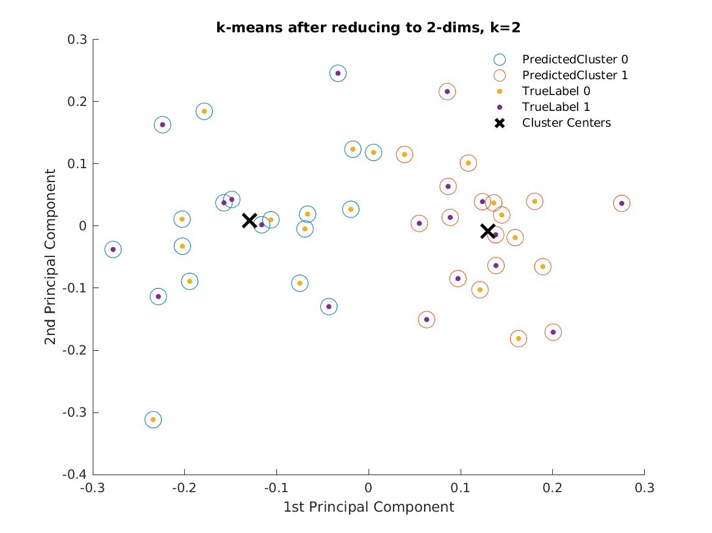
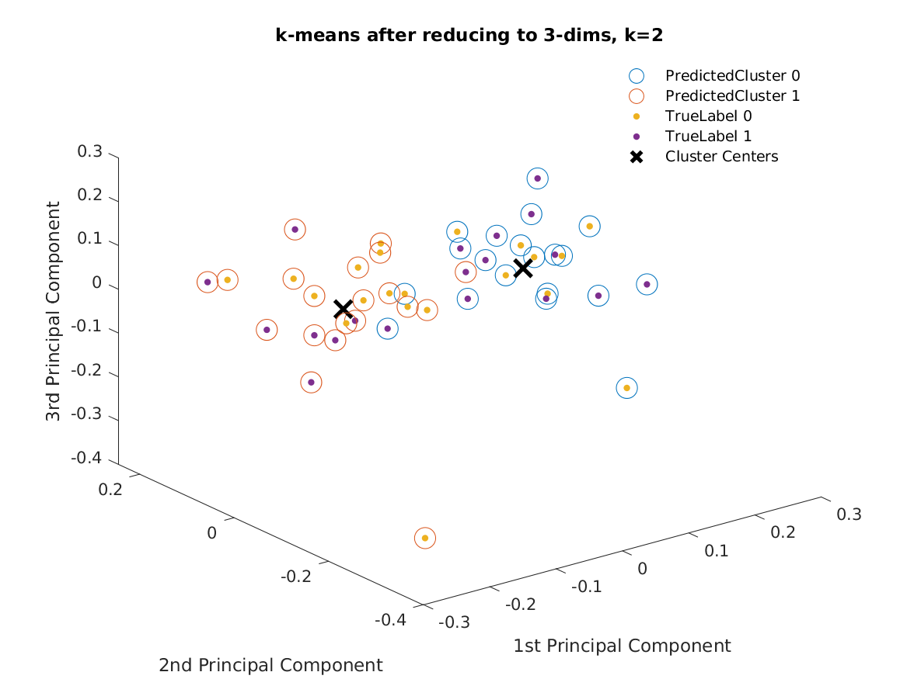
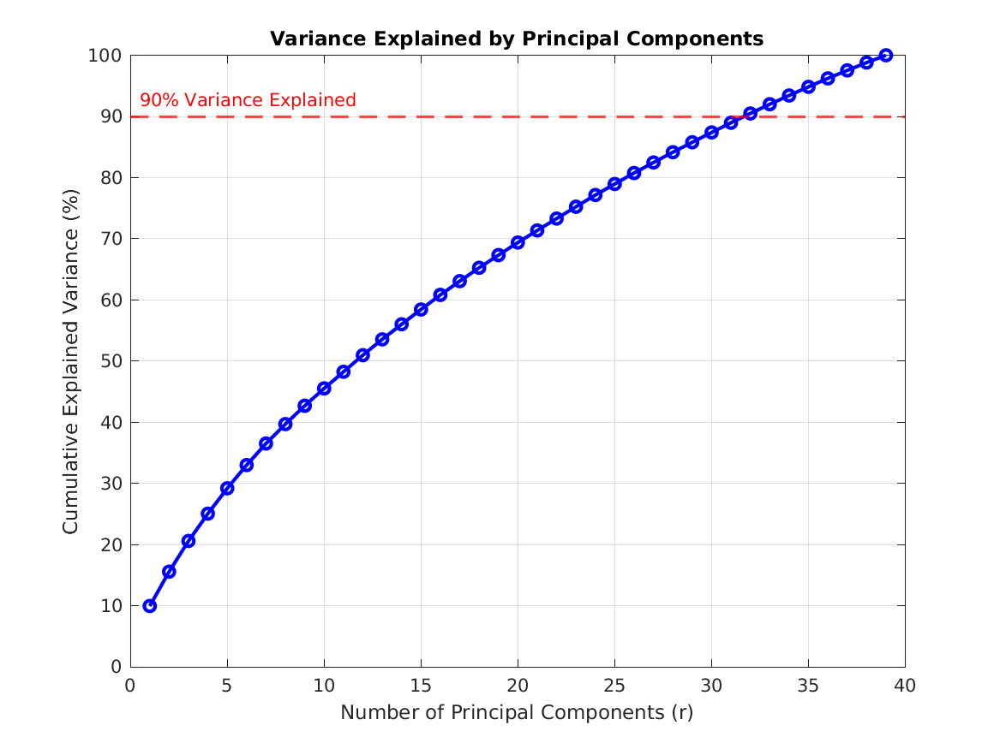

## Predicting Chronic Pain and Schizophrenia from rsfMRI data using rDCM

### Translational Neuromodeling (ETH Zurich Spring'24)

Mentored by: Imre Kertesz, Jakob Heinzle, Dr. Klaas Stephan (Translational Neuromodeling Unit)

In our project, we dealt with the question of how an rDCM model can be used on resting state fMRI data in regards to chronic pain and schizophrenia. For this, we used the fMRI dataset aquired by Tanaka et al.. We applied mutiple different approaches combining the rDCM model with different classification techniques in order to develop a partition which distinguishes healthy controls from chronic pain patients based on their resting state fMRI. Additionally, we wanted to investigate whether employing sparsity in our model space could also inform our classification and boost the clinical relevance. Particular focus was set on the differences in data-driven and anatomically-informed approaches in regards to their performance as well as interpretability.

The project can be divided mainly into 4 components with the code in both Julia and Matlab - 
1. Preprocessing fMRI data
2. Modelling and Model Inversion
3. Model Inversion Analysis
4. Classification

### Preprocessing fMRI data
The preprocessing pipeline can found inside the matlab subfolder.
It is run using the [srpbs_preprocess_pipeline(subject_choice,run,data_storage_structure)](https://gitlab.ethz.ch/tn-projects-fs2024/project4/-/blob/submission4/matlab/sprbs_preprocess_pipeline.m?ref_type=heads) matlab code function.

Starting matlab from within the matlab subfolder is recommended as the [startup.m](https://gitlab.ethz.ch/tn-projects-fs2024/project4/-/blob/submission4/matlab/startup.m?ref_type=heads) file loads spm12 and tapas-master to the path and ensures paths are correct.

The script requires 3 arguments - 
- subject_choice - a list of subjects to preprocess ( format - ["sub-1363", "sub-1364"])
- run = 1 - direct run; run=0 - display struct; run=2 - interactive run
- data_storage_structure = 1 - data is stored as described below; = 0 - data is stored in current directory

for data_storage_structure == 1 - data is stored as shown in the repository, as project4/SRPBS_OPEN/data - containing individual folders for each subject. 

Each subject folder should contain subfolders "anat", "func", "glm" with anatomical and rsfmri data respectively in .nii format and an empty "glm" subfolder.

It also assumes that the Brainnetome atlas is stored inside the data subfolder

(If needed the data can be extracted and placed in the corresponding directories using ([extract_data.sh](https://gitlab.ethz.ch/tn-projects-fs2024/project4/-/blob/submission4/extract_data.sh?ref_type=heads) - however this will require a change in the filepaths as it depends on where and how you want to store the data and where the tar.gz file is stored) 

In order to run on the Euler cluster as batch jobs, the [preprocess_pipeline.sh](https://gitlab.ethz.ch/tn-projects-fs2024/project4/-/blob/submission4/matlab/preprocess_pipeline.sh?ref_type=heads) can be used. However, it does not run nicely as the script to run glm requires a graphical display for a Java object.

An additional caveat is that in some MATLAB versions (tested 2022b) the extract_VOI_subject preprocessing script does not work when inside a for loop. In such case, either run a single subject or run it outside the loop by calling the function multiple times and passing values through a list. (Hack)

The outputs are then stored inside each subject folder with the 

### Modelling and Model Inversion
The models were run for mainly 2 parts - rDCM and sparse rDCM.

rDCM inversion was performed both on MATLAB and Julia
sparse rDCM inversion was performed only on Julia

For the rDCM inversion on MATLAB - 
Can be run using [rDCM_inversion(save_outputs,save_DCM,reduced_dataset,network,reduce_noise_thresh)](https://gitlab.ethz.ch/tn-projects-fs2024/project4/-/blob/submission4/matlab/rDCM_inversion.m) inside the matlab subfolder. 
All variables are optional; without specification a default rDCM inversion is run. (See code documentation for details)

-----------------------------

For rDCM and sparse rDCM inversion on Julia - 
The following was only run on the Euler cluster as batch jobs. 
This can be run using [srdcm.sh](https://gitlab.ethz.ch/tn-projects-fs2024/project4/-/blob/submission4/julia/srdcm.sh?ref_type=heads) inside the Julia subfolder (which contains the required Project.toml and Manifest.toml files). This submits one job per subject to the cluster.

The above shell script calls the [dcm_to_srdcm.jl](https://gitlab.ethz.ch/tn-projects-fs2024/project4/-/blob/submission4/julia/dcm_to_srdcm.jl?ref_type=heads) script.

(Logs are stored inside the "logs" subfolder inside "julia" subfolder)

The outputs are stored inside a created directory called "sparseInversion" inside each subject's data folder. The sparseInversion subfolder contains stored .mat files which are serialized mat files for their corresponding metrics. The sparse and rDCM inversions are stored inside .h5 file which can be accessed using h5read() function in MATLAB. The dataset structure is "/srdcm/m_all", "/srdcm/z_all", "/srdcm/F_r", "/rdcm/m_all", "/rdcm/F_r"

### Model Inversion Analysis
The Model Analysis contains mainly 3 parts - 

1. Heuristic Analysis
2. Model Selection based on Free Energy
3. Visualisations

The Heuristic Analysis requires a full set of posterior A matrices. Some examples for this are given in the connectivity_features/schizophrenia subfile. The scripts can be run inside the heuristic_analysis subfolder as follows:
[inter_groups_analysis(path,filetype,n,num_regions,n_perms,plot,show,network)](https://gitlab.ethz.ch/tn-projects-fs2024/project4/-/blob/submission4/heuristic_analysis/inter_groups_analysis.m) as well as 
[individual_connection_analysis(path,row,col)](https://gitlab.ethz.ch/tn-projects-fs2024/project4/-/blob/submission4/heuristic_analysis/individual_connection_analysis.m)
The path to the folder containing the A-matrices has to be specified. The other parameters are optional. Please refer to the code documentation for further details. 

-----------------------------

Model Selection based on free energy basically uses the Free energies generated during model inversion. The plots are in a Julia Jupyter notebook [ModelComparison.ipynb](https://gitlab.ethz.ch/tn-projects-fs2024/project4/-/blob/submission4/julia/ModelComparison.ipynb?ref_type=heads)

The script loads the free energies from the specified locations and uses them to plot the free energies

-----------------------------

The Visualisations were performed using the BrainNet Viewer (http://www.nitrc.org/projects/bnv/) (Xia et al., 2013)

### Classification

To use the classification pipeline, **ensure you are in `matlab` subdirectory of repo.**
```sh
cd matlab
ls
>>> +classification    +dcm      +preprocess    ...
```

Overview of classification pipeline:

1. Collate all rDCM parameter estimates for each configuration across all subjects
Go to `+dcm/collate_dcm_estimates`
```sh
matlab
>>> dcm.collate_dcm_estimates
>>> exit
```
**This creates a folder in `<ROOT>/estimates/` with features and labels saved.**

2. Run training sweep
```sh
. ./scripts/train_svms.sh
```
Sweeps over `+classification/svm_train.m` for different rDCM configurations.
See docstring for `svm_train.m` for details on args.
Logs are automatically saved in `<ROOT>/matlab/logs/training` directory.
Model checkpoints are saved in `<ROOT>/matlab/checkpoints/` directory.

3. Run testing sweep
```sh
. ./scripts/evaluate_svms.sh
```
Sweeps over `+classification/evaluate.m` for different rDCM configurations.
See docstring for `evaluate.m` for details on args.
Logs are automatically saved in `<ROOT>/matlab/logs/testing` directory.

If running into issues with files not found, especially `rootDir`, try manually 
passing in the `rootDir` as an argument to the scripts.

2D and 3D visualisations of generative embeddings can be created using 
`+classification/k_means.m` and `+classification/plotExplainedVariance.m`.
These were initial explorations and are not part of the main pipeline.

**Examples**:
Preliminary clustering and visualisations:





Plot of explained variance against principal components:




